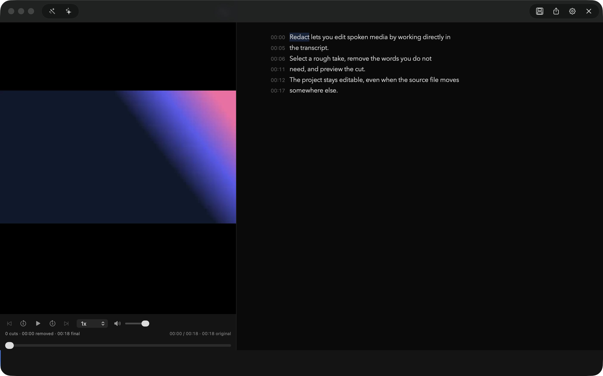

<p align="center">
  
</p>
<h1 align="center">Redact</h1>
<p align="center">Video editing without the video editor.<br>
Just a transcript, a few redactions, and a clean export.</p>
<p align="center"><strong>Version 1.2.0</strong> · macOS 14+ · Apple Silicon & Intel</p>
<p align="center"><a href="https://github.com/madebysan/redact/releases/latest"><strong>Download Redact</strong></a></p>

---

<p align="center">
  
</p>

## How it works

1. **Import** a video or audio file (MP4, MKV, WebM, MOV, AVI, MP3, WAV, M4A)
2. **Transcription** runs automatically via [WhisperKit](https://github.com/argmaxinc/WhisperKit) — on-device, word-level timestamps
3. **Click words** to select, then press Delete to mark them for removal
4. **Play** — deleted sections are skipped in real-time with smooth audio fades
5. **Export** — FFmpeg renders the final video with deleted sections cut out

## Features

- Word-level transcript editing with click, drag, shift-click, and cmd-click selection
- Real-time preview — plays through edits with configurable audio crossfades
- On-device transcription via WhisperKit (CoreML + Metal) — no Python, no cloud
- Waveform visualization with click-to-seek
- Unlimited undo/redo
- Export to MP4, MKV, or WebM with quality and speed options
- Export SRT subtitles (timestamps adjusted for deletions)
- Save/load `.rdt` project files
- Dark, Light, and System theme support
- Customizable transcript font, size, and highlight color
- ElevenLabs voice integration for TTS export
- Whisper model selection with English-only and turbo variants
- Native macOS app — no Electron, no browser

## Prerequisites

### FFmpeg (required)

```bash
brew install ffmpeg
```

That's it. Transcription is fully built-in — WhisperKit downloads the selected model automatically on first use.

## Install

1. Download the latest `.dmg` from [Releases](https://github.com/madebysan/redact/releases/latest)
2. Open the DMG and drag **Redact** to Applications
3. Launch Redact — if macOS blocks it, go to System Settings > Privacy & Security and click "Open Anyway"

## Keyboard shortcuts

| Action | Shortcut |
|--------|----------|
| Import media | Cmd+O |
| Save project | Cmd+S |
| Export video | Cmd+E |
| Export SRT | Cmd+Shift+E |
| Undo | Cmd+Z |
| Redo | Cmd+Shift+Z |
| Delete selected | Delete |
| Select all | Cmd+A |
| Play / Pause | Space |
| Skip back 5s | Left arrow |
| Skip forward 5s | Right arrow |
| Preferences | Cmd+, |

## Building from source

```bash
git clone https://github.com/madebysan/redact.git
cd redact
swift build
swift run Redact
```

## Tech stack

- **Swift + AppKit** — native macOS UI
- **AVFoundation** — video playback with CVDisplayLink-driven 60fps sync
- **WhisperKit** — on-device speech-to-text via CoreML + Metal
- **DSWaveformImage** — waveform visualization
- **FFmpeg** (subprocess) — audio extraction and video export

## Feedback

Found a bug or have a feature idea? [Open an issue](https://github.com/madebysan/redact/issues).

## License

MIT License — see [LICENSE](LICENSE) for details.

---

<p align="center">Made by <a href="https://santiagoalonso.com">santiagoalonso.com</a></p>
