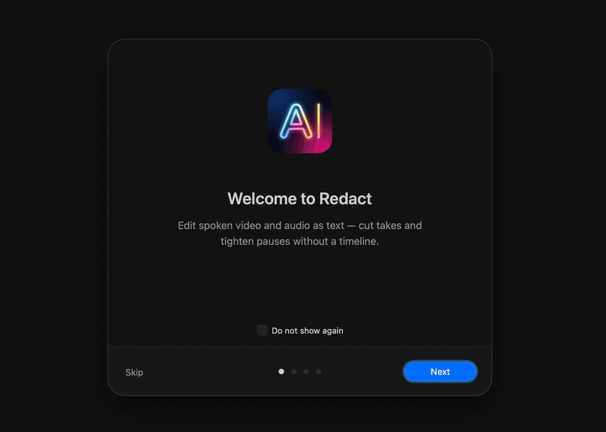
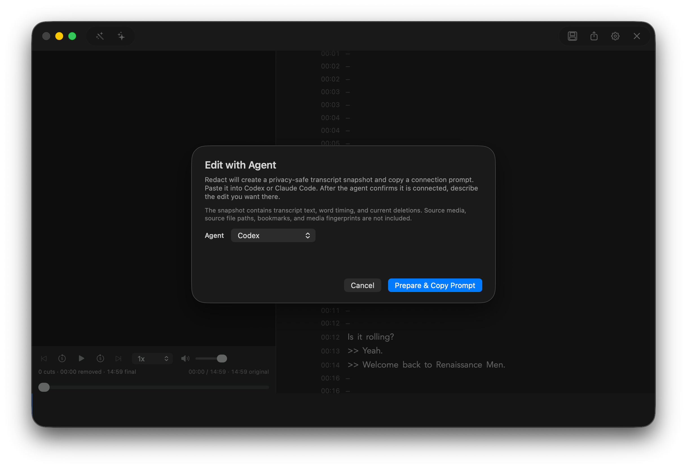
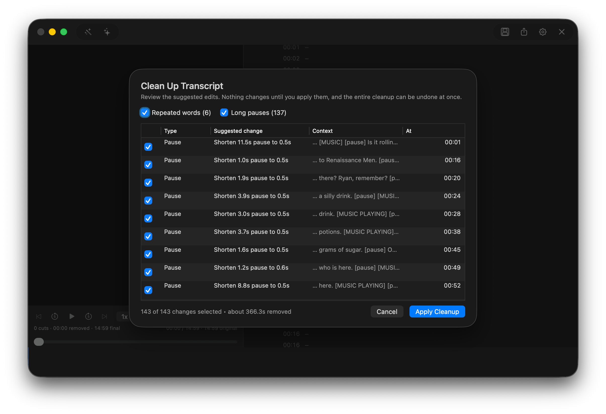
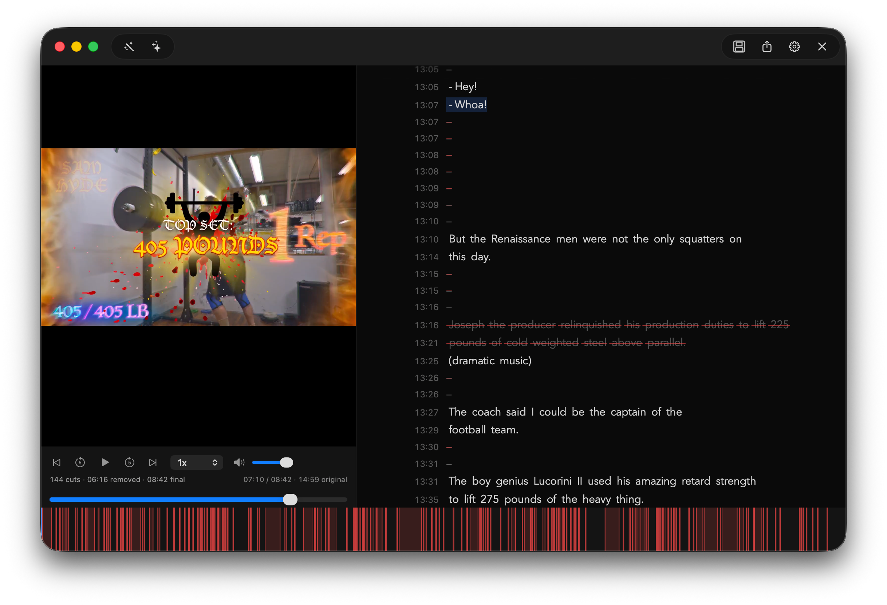

<p></p>

<h1>Redact</h1>

<p>Edit spoken video and audio as text.<br>
Cut takes, tighten pauses, clean up speech, and export without a timeline.</p>

<p><strong>Version 2.0.0</strong> · macOS 14+ · Apple Silicon</p>

<p>
  
  
  
  
</p>

<p><a href="https://github.com/madebysan/redact/releases/latest">Download Redact</a></p>



Redact is a native macOS editor for podcasts, interviews, tutorials, pitch videos, and other spoken media. Instead of cutting clips on a timeline, you edit the transcript and preview the result.

## Core features

### Edit with Codex or Claude Code

Prepare a privacy-safe transcript snapshot, paste the connection prompt into Codex or Claude Code, and describe the edit you want. Redact shows the proposed cuts and new duration before applying everything as one undoable edit.



### Auto-trim pauses and filler words

Clean Up finds clear filler words, repeated words, and long pauses. Review every suggestion, choose what to keep, and apply the selected changes in one click.



### Select, delete, and export

Highlight words and press Delete. Preview the finished pacing, restore any cut, then export the result as video, audio, or adjusted subtitles.



## How it works

1. Import a video or audio file.
2. Redact transcribes it locally with [WhisperKit](https://github.com/argmaxinc/WhisperKit).
3. Delete words, run automatic cleanup, or ask Codex or Claude Code to propose an edit.
4. Preview, save, and export.

Your normal editing workflow stays on your Mac. Agent editing is opt-in and shares only a sanitized transcript snapshot with the cloud agent you choose, never the source media or project paths.

## Export formats

| Output | Video | Audio |
|---|---|---|
| MP4 | H.264 | AAC |
| MKV | H.264 | AAC |
| WebM | VP9 | Opus |
| M4A | — | AAC |
| MP3 | — | MP3 |
| WAV | — | PCM |
| SRT | Adjusted subtitle timing | — |

## Install

Install FFmpeg first:

```bash
brew install ffmpeg
```

Open the Redact DMG, drag Redact to Applications, and launch it.

Redact 2 is built for Apple Silicon and requires macOS 14 or newer. It is distributed outside the Mac App Store and uses a user-installed FFmpeg executable for media processing.

## Preferences

Redact includes keyboard shortcuts for common editing, playback, project, and export actions.

Redact uses a dark interface only. Settings include a dropdown of 14 built-in macOS transcript fonts with adjustable text size, letter spacing, line spacing, playback highlight color, a transcript-only Restore Defaults action, and clearly labeled Whisper model trade-offs. Format, quality, speed, audio enhancement, and optional subtitle export are remembered for the next compatible export.

## Build from source

From the repository root:

```bash
brew install ffmpeg
./script/build_and_run.sh
```

The native UI uses Swift and AppKit. AVFoundation handles preview playback and timeline mapping, [DSWaveformImage](https://github.com/dmrschmidt/DSWaveformImage) renders the waveform, and FFmpeg handles extraction and final media export.

Release helpers live in `scripts/`:

```bash
./scripts/build-release.sh sign
./scripts/build-release.sh dmg
./scripts/build-release.sh release
```

## Feedback

Found a bug or have a feature idea? [Open an issue](https://github.com/madebysan/redact/issues).

## License

[MIT](LICENSE)

Made by [santiagoalonso.com](https://santiagoalonso.com)
